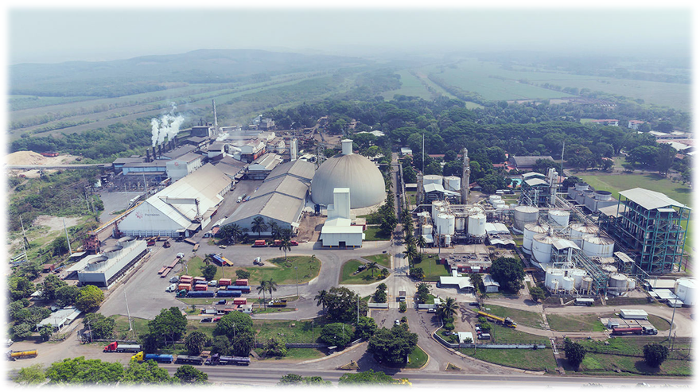
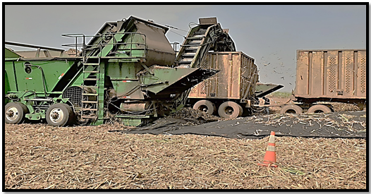

# Tarea de analisis de datos.
El objetico de la tarea es realizar un documento en markdown y conocer su productividad.

## Evaluacion de cleaner.
En la cosecha de caña se utilizan las cleaners son equipos de disminucion de trans en los toletes cortadas. 

[Articulo](https://hemeroteca.unad.edu.co/index.php/publicaciones-e-investigacion/article/view/570)



# Resumen datos Cleaner.


```{r echo=FALSE}
setwd("c:/users/easoto/OneDrive - Pantaleon. S.A/Documentos/GitHub/Data-Alex")
library(readxl)
Ensayo_Cleaner <- read_excel("Ensayo Cleaner.xlsx", 
sheet = "TCH BASCULA", range = "A1:N17")
View(Ensayo_Cleaner)
summary(Ensayo_Cleaner$TCH)

```
# Matriz de Datos a evaluar.

```{r echo=FALSE}
library(psych)
describeBy(Ensayo_Cleaner$TCH, group = Ensayo_Cleaner$DESCRIPCION, mat = TRUE, digits = 2)
```

# HISTOGRAMA.

```{r echo=FALSE}
hist(Ensayo_Cleaner$TCH, main = "Histograma", col = "blue", ylab = "Frecuencia")

```


# bOXplot.

```{r}
boxplot(Ensayo_Cleaner$TCH ~ Ensayo_Cleaner$DESCRIPCION, main="TCH CLEANER", col="orange")
```


# ANOVA.
```{r}
anova <- aov(Ensayo_Cleaner$TCH ~ Ensayo_Cleaner$DESCRIPCION)
summary(anova)
```


# Regresion Lineal.

```{r}
plot(Ensayo_Cleaner$TCH~Ensayo_Cleaner$ML)
cor.test(Ensayo_Cleaner$TCH,Ensayo_Cleaner$ML)
```

# Conclusion.
Estamos aprendiendo.


```{r}
library(ggplot2)
names(Ensayo_Cleaner)
class(Ensayo_Cleaner)
Ensayo_Cleaner
modelo1 = lm(ML ~ TCH, data = Ensayo_Cleaner, na.action = na.exclude)
summary(modelo1)

ML= 418.62 + 0.08421
grafica1 = ggplot(Ensayo_Cleaner, aes(ML , TCH))
grafica1 + geom_point()
grafica1 + geom_point() + geom_smooth(method = "lm", colour= "Red") 
```


